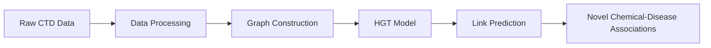
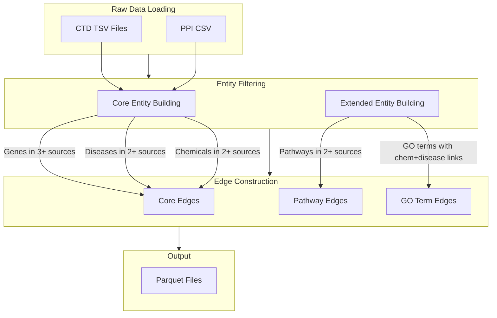
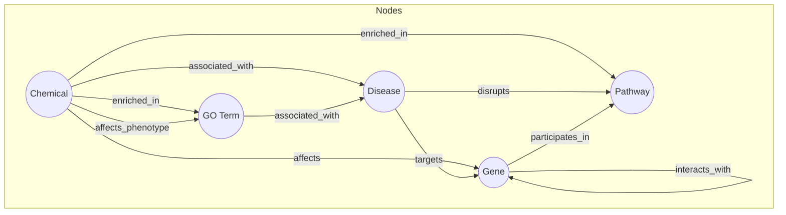
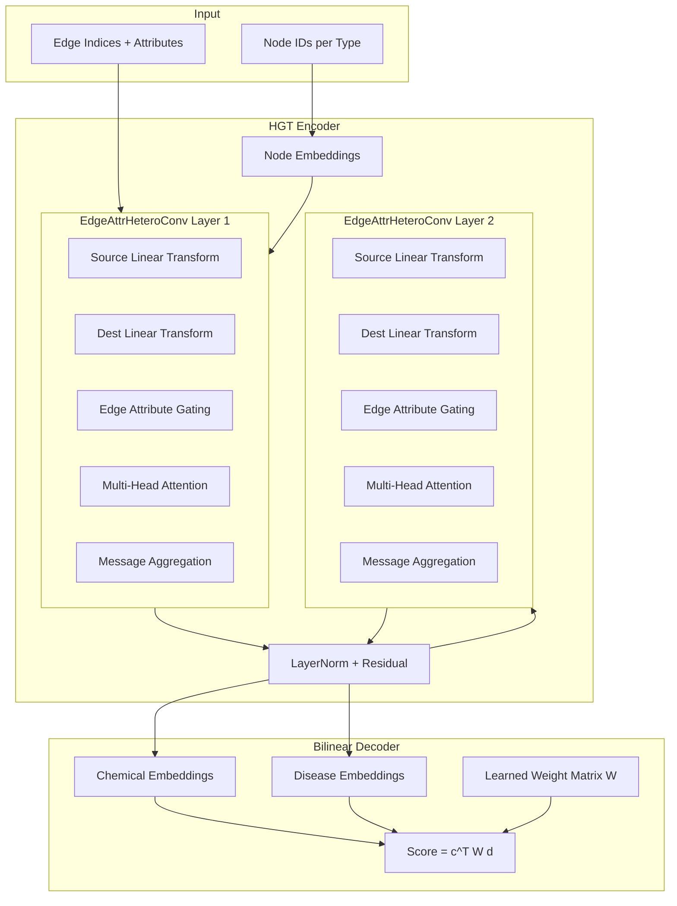
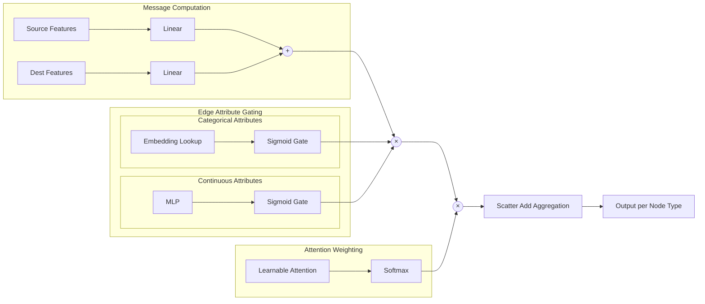

# Chemical-Disease Link Prediction with Heterogeneous Graph Transformers

A deep learning system for predicting novel associations between chemicals and diseases using Heterogeneous Graph Transformers (HGT) on biomedical knowledge graphs. The model uses multi-relational data from the Comparative Toxicogenomics Database and protein-protein interaction networks to learn rich representations of chemicals, diseases, genes, pathways, and GO terms.

## Table of Contents

- [Overview](#overview)
- [Project Structure](#project-structure)
- [Datasets](#datasets)
- [Data Processing Pipeline](#data-processing-pipeline)
- [Graph Construction](#graph-construction)
- [Model Architecture](#model-architecture)
- [Training](#training)
- [Evaluation Metrics](#evaluation-metrics)
- [Results](#results)
- [Usage](#usage)

## Overview

This project implements an end-to-end pipeline for chemical-disease link prediction:



The system predicts potential therapeutic or toxic relationships between chemicals and diseases by learning from existing biomedical knowledge encoded as a heterogeneous graph.

## Project Structure

```
dd/
├── app.py                          # Streamlit web UI for predictions
├── README.md                       # This file
├── main.ipynb                      # Jupyter notebook for exploration
├── explore.ipynb                   # Additional exploration notebook
│
├── src/                            # Main source code package
│   ├── __init__.py
│   ├── data/                       # Data processing modules
│   │   ├── __init__.py
│   │   ├── processing.py           # Raw data loading & preprocessing
│   │   ├── graph.py                # PyG HeteroData construction
│   │   └── splits.py               # Train/val/test splitting
│   ├── models/                     # Model architecture
│   │   ├── __init__.py
│   │   ├── hgt.py                  # HGT model implementation
│   │   ├── predictor.py            # Inference wrapper (full-graph)
│   │   └── predictor_efficient.py  # Cached/low-memory inference utilities
│   └── training/                   # Training utilities
│       ├── __init__.py
│       ├── trainer.py              # Training loop with MLflow
│       └── utils.py                # Loss functions & metrics
│
├── scripts/                        # Entry point scripts
│   ├── process_data.py             # Data preprocessing script
│   ├── train.py                    # Model training script
│   ├── evaluate.py                 # Comprehensive evaluation
│   ├── predict.py                  # CLI inference script (full graph)
│   ├── cache_embeddings.py         # Cache embeddings (full graph)
│   ├── cache_embeddings_lowmem.py  # Cache embeddings (legacy low-memory)
│   ├── cache_embeddings_chunked.py # Main cache builder (streaming chunks)
│   └── predict_cached.py           # CLI inference (cached embeddings)
│
├── data/
│   ├── raw/                        # Raw CTD and PPI data files
│   └── processed/                  # Processed parquet files
│
├── /checkpoints/                   # Model checkpoints base directory
│   ├── best.pt                     # Best model (by validation metric)
│   └── last.pt                     # Latest checkpoint
│
├── evaluation_results/             # Evaluation outputs
│   ├── metrics.json                # Test set metrics
│   ├── roc_curve.png               # ROC curve visualization
│   ├── pr_curve.png                # Precision-Recall curve
│   └── report.html                 # Full evaluation report
│
└── mlruns/                         # MLflow experiment tracking
```

## Datasets

### Primary Data Sources

The system integrates data from two major sources:

#### 1. Comparative Toxicogenomics Database (CTD)

CTD provides curated information about chemical-gene/protein interactions, chemical-disease and gene-disease relationships:

| File | Description |
|------|-------------|
| `CTD_chem_gene_ixns.tsv` | Chemical-gene interactions with action types |
| `CTD_curated_chemicals_diseases.tsv` | Curated chemical-disease associations |
| `CTD_curated_genes_diseases.tsv` | Curated gene-disease associations |
| `CTD_chemicals.tsv` | Chemical annotations and metadata |
| `CTD_diseases.tsv` | Disease annotations and metadata |
| `CTD_genes.tsv` | Gene annotations and metadata |
| `CTD_chem_pathways_enriched.tsv` | Chemical-pathway enrichment statistics |
| `CTD_chem_go_enriched.tsv` | Chemical-GO term enrichments |
| `CTD_genes_pathways.tsv` | Gene-pathway associations |
| `CTD_diseases_pathways.tsv` | Disease-pathway associations |
| `CTD_pheno_term_ixns.tsv` | Phenotype interactions |
| `CTD_Phenotype-Disease_*.tsv` | Phenotype-disease associations |

**Download:** https://ctdbase.org/downloads/

#### 2. SNAP Protein-Protein Interactions

| File | Description |
|------|-------------|
| `PP-Decagon_ppi.csv` | Protein-protein interaction network |

**Download:** https://snap.stanford.edu/biodata/datasets/10008/files/PP-Decagon_ppi.csv.gz

### Data Statistics

After processing, the dataset contains:
- **Chemicals:** Compounds with known biological interactions
- **Diseases:** Disease entities from MESH/OMIM ontologies
- **Genes:** Genes present in chem-gene, disease-gene, AND PPI data
- **Pathways:** Biological pathways (KEGG, Reactome) with 2+ data source links
- **GO Terms:** Gene Ontology terms with chemical AND disease connections

## Data Processing Pipeline

The processing pipeline (`src/data/processing.py`) performs several key operations:



### Processing Steps

1. **Raw Data Loading:** Lazy loading with Polars for memory efficiency
2. **Core Entity Building:** Creates nodes that appear across multiple data sources
   - Genes must appear in chem-gene, disease-gene, AND PPI data
   - Diseases must appear in disease-gene AND chem-disease data
   - Chemicals must appear in chem-gene AND chem-disease data
3. **Extended Entity Building:**
   - Pathways must appear in 2+ sources (gene-pathway, disease-pathway, chem-pathway)
   - GO terms must have both chemical AND disease links
4. **Edge Table Construction:** With edge attributes (action types, enrichment statistics)
5. **Output:** Parquet files for fast loading

## Graph Construction

### Heterogeneous Graph Schema

The graph consists of 5 node types and 10+ edge types (plus reverse edges):



### Node Types

| Node Type | Description | Features |
|-----------|-------------|----------|
| `chemical` | Chemical compounds | Embedding lookup by ID |
| `disease` | Disease entities | Embedding lookup by ID |
| `gene` | Gene/protein entities | Embedding lookup by ID |
| `pathway` | Biological pathways | Embedding lookup by ID |
| `go_term` | GO terms/phenotypes | Embedding lookup by ID + ontology type |

### Edge Types with Attributes

| Edge Type | Description | Attributes |
|-----------|-------------|------------|
| `(chemical, associated_with, disease)` | **Target edges for prediction** | None |
| `(chemical, affects, gene)` | Chemical-gene interactions | `ACTION_TYPE`, `ACTION_SUBJECT` |
| `(disease, targets, gene)` | Disease-gene associations | None |
| `(gene, interacts_with, gene)` | PPI network | None |
| `(gene, participates_in, pathway)` | Gene-pathway membership | None |
| `(disease, disrupts, pathway)` | Disease-pathway disruption | `INFERENCE_GENE_COUNT` |
| `(chemical, enriched_in, pathway)` | Chemical-pathway enrichment | `NEG_LOG_PVALUE`, `TARGET_RATIO`, `FOLD_ENRICHMENT` |
| `(chemical, enriched_in, go_term)` | Chemical-GO enrichment | 5 features (p-value, ratios, ontology) |
| `(chemical, affects_phenotype, go_term)` | Phenotype effects | `PHENO_ACTION_TYPE` |
| `(go_term, associated_with, disease)` | GO-disease associations | 3 features (ontology, inference counts) |

All edges have corresponding reverse edges for bidirectional message passing.

## Model Architecture

### Overview

The model (`HGTPredictor`) consists of a heterogeneous graph encoder and a bilinear decoder:



### EdgeAttrHeteroConv Layer

Custom heterogeneous convolution with edge attribute support:



### Key Components

1. **Node Embeddings:** Learnable embeddings per node type
   ```python
   nn.Embedding(num_nodes, hidden_dim)  # per node type
   ```

2. **EdgeAttrHeteroConv:** Per-edge-type message passing with:
   - Linear transforms for source and destination nodes
   - Categorical edge attribute embeddings (action types)
   - Continuous edge attribute projections (enrichment statistics)
   - Multi-head attention weights
   - Output projection per node type

3. **Layer Normalization:** Per node type, per layer with residual connections

4. **Bilinear Decoder:** Scores chemical-disease pairs
   ```
   score = sum(c @ W_cd * d)
   ```
   where `c` is chemical embedding, `d` is disease embedding, and `W_cd` is a learned weight matrix.

### Hyperparameters

| Parameter | Default | Description |
|-----------|---------|-------------|
| `hidden_dim` | 128 | Embedding and hidden dimension |
| `num_layers` | 2 | Number of message passing layers |
| `num_heads` | 4 | Number of attention heads |
| `dropout` | 0.2 | Dropout probability |
| `edge_attr_dim` | 32 | Dimension for categorical edge embeddings |

## Training

### Training Configuration

| Parameter | Default | Description |
|-----------|---------|-------------|
| `epochs` | 50-200 | Maximum training epochs |
| `batch_size` | 2048-4096 | Mini-batch size |
| `lr` | 3e-4 | Initial learning rate |
| `weight_decay` | 1e-4 | L2 regularization |
| `grad_clip` | 1.0 | Gradient clipping norm |
| `num_neg_train` | 5-20 | Negatives per positive (training) |
| `num_neg_eval` | 20 | Negatives per positive (evaluation) |
| `val_ratio` | 0.1 | Validation split ratio |
| `test_ratio` | 0.1 | Test split ratio |
| `patience` | 10 | LR scheduler patience |
| `factor` | 0.5 | LR reduction factor |
| `early_stopping` | 20 | Early stopping patience |
| `num_neighbours` | [10, 5] | Neighbor sampling per layer |

### Negative Sampling Strategy

The negative sampling strategy corrupts either the chemical OR disease (not both) while avoiding collisions with known positive edges:

```python
# For each positive (c, d) pair:
# 1. Randomly choose to corrupt chemical OR disease
# 2. Sample random entity of that type
# 3. Check against known positives, resample if collision
```

### MLflow Integration

Training progress is logged to MLflow including:
- Hyperparameters
- Training/validation metrics per epoch
- Model checkpoints
- Artifacts (plots, evaluation results)

## Evaluation Metrics

### Classification Metrics

| Metric | Description |
|--------|-------------|
| **AUROC** | Area Under ROC Curve - measures ranking quality across all thresholds |
| **AUPRC** | Area Under Precision-Recall Curve - better for imbalanced data |
| **Precision@t** | Precision at threshold t (0.3, 0.5, 0.7) |
| **Recall@t** | Recall at threshold t |
| **F1@t** | F1 score at threshold t |

### Ranking Metrics

| Metric | Description |
|--------|-------------|
| **MRR** | Mean Reciprocal Rank - average of 1/rank for positive samples |
| **Mean Rank** | Average rank of positive samples |
| **Median Rank** | Median rank of positive samples |
| **Hits@K** | Fraction of positives ranked in top K (K = 5, 10, 20, 50) |

### Per-Entity Analysis

The evaluation also computes:
- Per-disease AUROC/AUPRC distribution
- Per-chemical AUROC/AUPRC distribution
- Performance stratified by entity connectivity

## Results

### Test Set Performance

| Metric | Value |
|--------|-------|
| **AUROC** | 0.9414 |
| **AUPRC** | 0.3422 |
| **MRR** | 0.5556 |
| **Mean Rank** | 3.80 |
| **Median Rank** | 2.0 |
| **Hits@5** | 0.7927 |
| **Hits@10** | 0.9356 |
| **Hits@20** | 0.9874 |
| **Hits@50** | 1.0000 |

### Threshold-Based Classification

| Threshold | Precision | Recall | F1 |
|-----------|-----------|--------|-----|
| 0.3 | 0.3090 | 0.4318 | 0.3603 |
| 0.5 | 0.3789 | 0.3433 | 0.3602 |
| 0.7 | 0.4647 | 0.2601 | 0.3336 |

### Interpretation

- **High AUROC (94.14%):** The model effectively distinguishes positive from negative chemical-disease pairs
- **Strong Hits@10 (93.56%):** For most queries, the true association is ranked in the top 10 predictions
- **Low AUPRC (34.22%):** Reflects the challenge of class imbalance in link prediction tasks
- **Median Rank of 2:** The true positive is typically the 2nd-ranked prediction

## Usage

### YAML Config Support

All main scripts support `--config <yaml-file>`. See `YAML_CONFIGS.md` and `configs/examples/`.

### 1. Process Raw Data

```bash
python -m scripts.process_data --raw-dir ./data/raw --processed-dir ./data/processed
```

### 2. Train Model

```bash
# Basic training
python -m scripts.train \
    --processed-dir ./data/processed \
    --hidden-dim 128 \
    --num-layers 2 \
    --num-heads 4 \
    --epochs 200 \
    --batch-size 2048

# Full configuration
python -m scripts.train \
    --processed-dir ./data/processed \
    --hidden-dim 256 \
    --num-layers 3 \
    --num-heads 4 \
    --dropout 0.003 \
    --epochs 200 \
    --batch-size 4096 \
    --lr 3e-4 \
    --weight-decay 1e-4 \
    --grad-clip 1.0 \
    --num-neg-train 20 \
    --num-neg-eval 20 \
    --val-ratio 0.1 \
    --test-ratio 0.1 \
    --patience 10 \
    --factor 0.5 \
    --early-stopping 20 \
    --ckpt-dir /checkpoints \
    --run-name hgt_cd_lp \
    --experiment-name HGT_linkpred
```

### 3. Evaluate Model

```bash
python -m scripts.evaluate \
    --processed-dir ./data/processed \
    --checkpoint /checkpoints/best.pt \
    --output-dir ./evaluation_results
```

### 4. Make Predictions

```bash
# Single pair prediction
python -m scripts.predict --disease MESH:D003920 --chemical D008687

# Top-K predictions for a disease
python -m scripts.predict --disease MESH:D003920 --top-k 10

# Top-K predictions for a chemical
python -m scripts.predict --chemical D008687 --top-k 10
```

### 5. Cached Embeddings

The Streamlit app and CLI can use cached embeddings to avoid loading the full graph.

```bash
# Create cached embeddings (recommended)
python -m scripts.cache_embeddings_chunked --checkpoint /checkpoints/best.pt --output-dir ./embeddings --chunk-size 30000

# Optional alternatives
python -m scripts.cache_embeddings --checkpoint /checkpoints/best.pt --output-dir ./embeddings
python -m scripts.cache_embeddings_lowmem --checkpoint /checkpoints/best.pt --output-dir ./embeddings --chunk-size 30000

# Use cached inference
python -m scripts.predict_cached --disease MESH:D003920 --top-k 10
```

**Known-link annotations:** cached predictors can flag whether a prediction is already in CTD.
Use `--exclude-known` to hide known links in top-k results.

### 6. Web Interface

```bash
streamlit run app.py
```

Access the web UI at `http://localhost:8501` for interactive predictions.

The UI can use cached embeddings for faster startup and lower memory usage. Enable
"Use Cached Embeddings" in the sidebar and point to your `./embeddings` directory.

## Acknowledgments

- [Comparative Toxicogenomics Database (CTD)](https://ctdbase.org/)
- [Stanford Network Analysis Platform (SNAP)](https://snap.stanford.edu/)
- [PyTorch Geometric](https://pytorch-geometric.readthedocs.io/)
