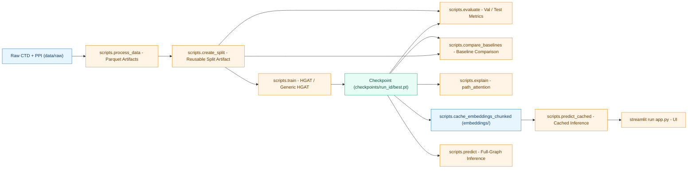
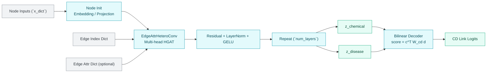
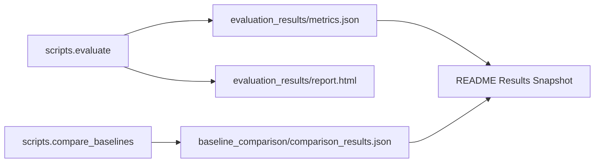

# Chemical-Disease Link Prediction (HGAT / HeteroGAT)

This repository implements an end-to-end pipeline for chemical-disease link prediction on a heterogeneous biomedical graph.

It includes:
- Data processing from raw CTD/PPI tables to parquet artifacts
- Heterogeneous graph construction with optional extended node/edge types
- Reproducible split artifact creation and strict split reuse across train/eval/test
- Main model training (`HGATPredictor`) and schema-driven variant (`GenericLinkPredictor`)
- Baseline training/evaluation and checkpoint-vs-baseline comparison
- Full-graph and cached-embedding inference
- Path-based explainability (`path_attention`)
- Streamlit UI for cached inference workflows

## Pipeline Overview



## Model Architecture Overview

`HGATPredictor` combines schema-aware heterogeneous message passing with a bilinear CD link decoder:
- Per-node-type initialization via dense projection (feature mode) or embedding lookup (ID mode)
- Stacked `EdgeAttrHeteroConv` layers with multi-head attention
- Optional edge-attribute gates for categorical/continuous edge features
- Residual + LayerNorm + GELU updates at each message-passing layer
- Bilinear decoder (`W_cd`) for chemical-disease scoring



## Results Snapshot

The metrics below are from the current local evaluation artifacts:
- `evaluation_results/metrics.json`
- `baseline_comparison/comparison_results.json`

### Main Model (Evaluation Report)

| Metric | Value |
|---|---:|
| AUROC | 0.9489 |
| AUPRC | 0.4711 |
| MRR | 0.7083 |
| Hits@10 | 0.9992 |
| Hits@20 | 1.0000 |
| Hits@50 | 1.0000 |

### Baseline Comparison (Shared Split Protocol)

| Model | Val AUPRC | Test AUPRC | Val AUROC | Test AUROC |
|---|---:|---:|---:|---:|
| `main_hgat` | 0.3921 | 0.3984 | 0.9259 | 0.9280 |
| `degree` | 0.1782 | 0.1873 | 0.7801 | 0.7847 |
| `mf` | 0.1695 | 0.1794 | 0.7558 | 0.7579 |



## Quick Start

Run commands from repository root.

1. Process raw data:
```bash
python -m scripts.process_data \
  --raw-dir ./data/raw \
  --processed-dir ./data/processed
```

2. Create a reusable split artifact (recommended):
```bash
python -m scripts.create_split \
  --processed-dir ./data/processed \
  --output-path ./splits/cd_split_seed42.pt \
  --include-extended \
  --seed 42 \
  --val-ratio 0.1 \
  --test-ratio 0.1 \
  --split-strategy stratified
```

3. Train the main HGAT model using that exact split:
```bash
python -m scripts.train \
  --processed-dir ./data/processed \
  --split-artifact-path ./splits/cd_split_seed42.pt \
  --epochs 50 \
  --batch-size 4096
```

4. Evaluate on val/test with the same split artifact:
```bash
python -m scripts.evaluate \
  --checkpoint ./checkpoints/<run_id>/best.pt \
  --processed-dir ./data/processed \
  --split-artifact-path ./splits/cd_split_seed42.pt \
  --split test
```

Evaluation/compare runs enforce `configs/examples/eval_protocol.yaml` by default (currently fixed `num_neg_eval=20`, `eval_hard_negative_ratio=0.0`, split-artifact-required). For exploratory runs, pass `--allow-noncomparable`.

## Inference

### Inference Modes


### Full-Graph Predictor

```bash
python -m scripts.predict \
  --checkpoint ./checkpoints/<run_id>/best.pt \
  --processed-dir ./data/processed \
  --disease MESH:D014202 \
  --chemical C006901
```

### Cached-Embedding Predictor (Memory-Efficient)

1. Build cache tensors:
```bash
python -m scripts.cache_embeddings_chunked \
  --processed-dir ./data/processed \
  --checkpoint ./checkpoints/<run_id>/best.pt \
  --output-dir ./embeddings
```

2. Query with cached embeddings:
```bash
python -m scripts.predict_cached \
  --processed-dir ./data/processed \
  --embeddings-dir ./embeddings \
  --disease MESH:D014202 \
  --chemical C006901
```

## Explainability

Current production mode is `path_attention` only.

```bash
python -m scripts.explain \
  --processed-dir ./data/processed \
  --checkpoint ./checkpoints/<run_id>/best.pt \
  --disease MESH:D014202 \
  --chemical C006901 \
  --mode path_attention
```

Fast/OOM-safe pattern:
1. First pass without attention (`--no-attention`, tighter path limits)
2. Re-run with attention only for a small set of pairs
3. In attention runs, keep path limits and graph scope conservative

## Baseline Comparison

Compare a trained main checkpoint against baselines on the same split artifact:

```bash
python -m scripts.compare_baselines \
  --checkpoint ./checkpoints/<run_id>/best.pt \
  --processed-dir ./data/processed \
  --split-artifact-path ./splits/cd_split_seed42.pt \
  --baselines degree,mf,generic_hgat \
  --output-dir ./baseline_comparison
```

Outputs:
- `comparison_results.json`
- `comparison_results.csv`

`comparison_results.json` now also contains an `evaluation_protocol` section describing comparability checks and any violations.

## Smoke Tests

Main HGAT end-to-end smoke:
```bash
python -m scripts.smoke_e2e \
  --epochs 1 \
  --batch-size 1024 \
  --baseline-models degree,mf,generic_hgat
```

GenericHGAT end-to-end smoke:
```bash
python -m scripts.smoke_generic_hgat \
  --processed-dir ./data/processed \
  --skip-process \
  --epochs 1 \
  --baseline-models degree,mf,generic_hgat
```

## Streamlit App

The UI runs on cached embeddings (to avoid loading full-graph model inference into memory):

```bash
streamlit run app.py
```

Before first run, generate `./embeddings` with `scripts.cache_embeddings_chunked`.

## YAML Configs

Most scripts support `--config`.

See:
- `YAML_CONFIGS.md`
- `configs/examples/README.md`

Example:
```bash
python -m scripts.train --config configs/examples/train.yaml
```

## Project Layout


## Module Docs

- `src/README.md`
- `src/data/README.md`
- `src/models/README.md`
- `src/models/architectures/README.md`
- `src/models/inference/README.md`
- `src/models/baselines/README.md`
- `src/training/README.md`
- `src/explainability/README.md`

## Testing

Run all tests:

```bash
pytest -q
```

Run selected suites:

```bash
pytest -q tests/test_data_splits.py tests/test_models.py tests/test_inference.py
```

## Operational Notes

- For reproducibility, prefer explicit split artifacts (`scripts.create_split`) and pass them to train/eval/compare.
- `scripts.train.py` logs to MLflow and writes run-scoped checkpoints under `./checkpoints/`.
- Checkpoint graph schema must match runtime graph schema (`--no-extended` vs default extended graph).
- Cached inference/explainability is the default path for memory-constrained environments.
